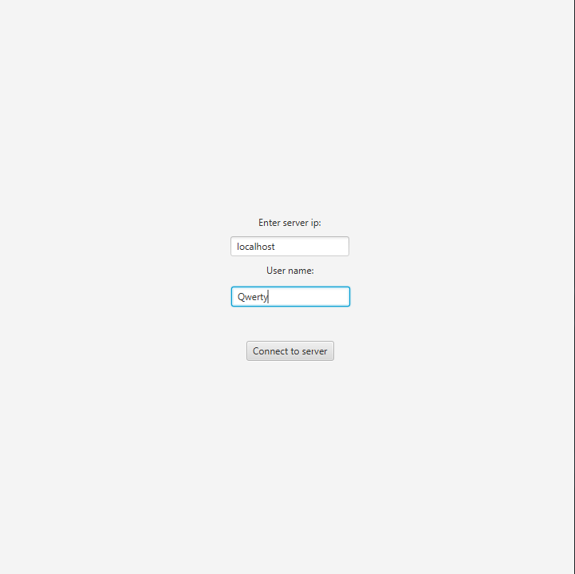
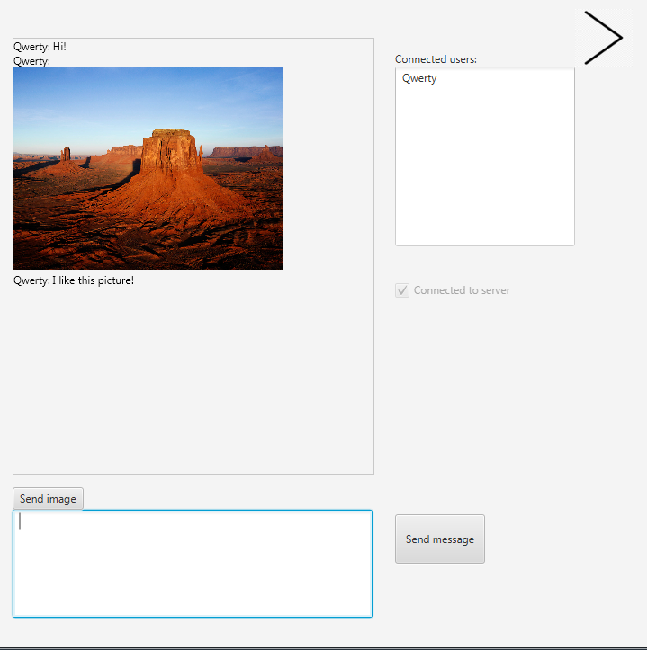

# Chat JavaFX

The project include both server and client.

#### To connect to server You can type: localhost or your's local IP (server have fixed 1025 port).

#### If You want to connect to Your server from remote and You are behind router with NAT, then You have to add port forwarding on router. Then client use router (your) public IP

#### If you have troubles with running JavaFX Main class, go to Edit configurations -> Insert thin in Main in VM options:  --module-path "C:\yourPathToJavaFX\lib" --add-modules javafx.controls,javafx.fxml

## Connecting to server

## Sending text message and image

